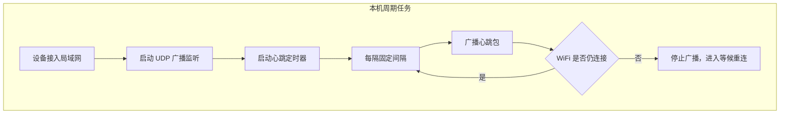
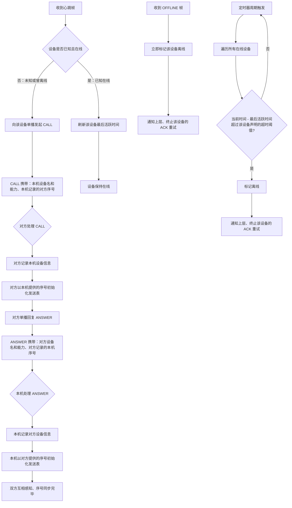
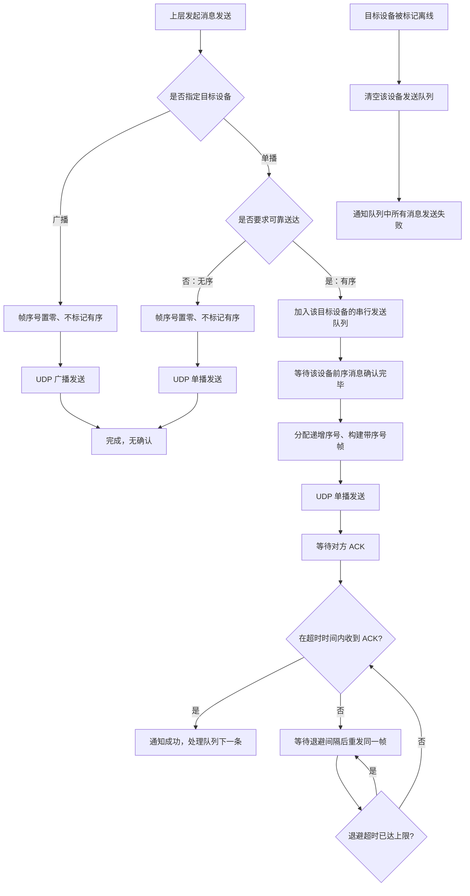
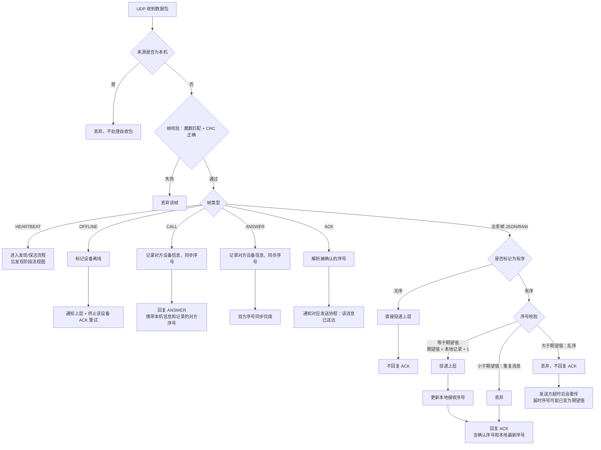

# UdpClient 模块设计

## 模块划分

```
client/
├── UdpClient.kt            # 统一入口，组合子模块，暴露 connect/disconnect/send/监听 API
├── FrameCodec.kt           # 帧编解码：encode（10 字节帧头+Payload+CRC）、decode（校验+解析）
├── MessageRouter.kt        # 消息路由：按 Type 分发 → 有序序号校验/Ack 回复
├── HeartbeatEngine.kt      # 心跳引擎：定时广播 Heartbeat + 内部离线检测
├── AckEngine.kt            # Ack 引擎：有序消息注册 → 指数退避重传 → 超时回调
├── RetryPolicy.kt          # 重试策略：首超时间、最大次数、退避倍数
├── DeviceRegistry.kt       # 设备注册表：CRUD、在线状态、心跳参数
├── SeqManager.kt           # 序号管理：按主机号维护对端有序序号，严格递增校验
├── NetworkMonitor.kt       # 网络监听：WiFi 状态变化 → 断线重连
├── ClientConfig.kt         # 配置聚合：协议常量、心跳/Ack/重试参数
└── socket/
    ├── UdpSocket.kt        # UDP Socket 管理：创建/销毁、三种发送、本机 IP 收集
    └── SocketReader.kt     # 帧读取器：协程循环接收、自收过滤、解码输出
```

---

## 发现阶段

设备从接入局域网到互相感知设备信息的完整流程。

> **说明**：心跳采用 UDP 广播，本机不接收自己发出的心跳包。





---

## 通信阶段

设备间发送和接收消息的完整流程，包含有序消息的序号校验、ACK 确认、指数退避重传机制。

### 发送流程

同一目标设备的有序消息**串行发送**，前一条确认后才发下一条；无序消息直接发送不等待。



`Q -->|是| P` 表示退避超时达到上限后不再增长，以固定最大间隔持续重试，直到 ACK 或设备离线，不会主动放弃。

### 接收流程



### 重试策略

有序消息无需限制重试次数，仅通过最大超时时间防止退避无限增长；重试将持续到 ACK 或设备离线为止。

| 参数 | 含义 |
|------|------|
| 初始超时 | 首次发送后等待 ACK 的时间 |
| 退避倍数 | 每次超时后等待时间乘以此倍数 |
| 最大超时 | 退避增长的上限，达到后不再增加 |

**示例**（初始 150ms / 倍数 ×2 / 最大 5s）：

| 轮次 | 等待超时 |
|------|---------|
| 第 1 次发送 | 150ms |
| 第 2 次（重试） | 300ms |
| 第 3 次（重试） | 600ms |
| 第 4 次（重试） | 1.2s |
| 第 5 次（重试） | 2.4s |
| 第 6 次及以后 | 5s（封顶） |

> 无限重试，直至收到 ACK 或设备离线。
